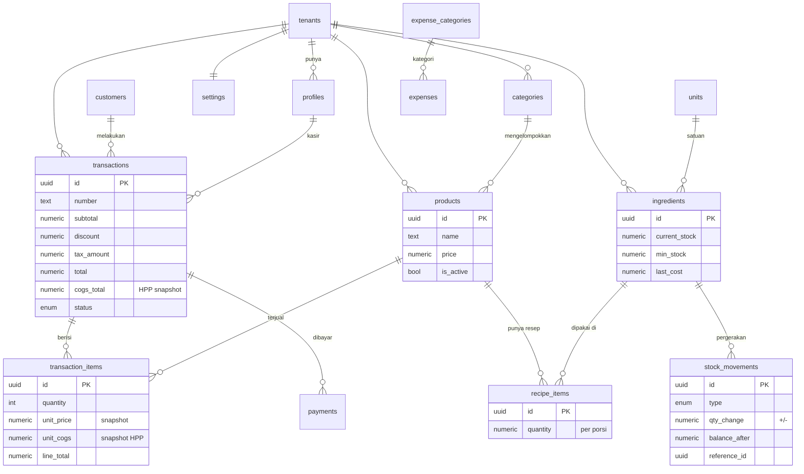

# Herbaspace POS — ERD (Entity Relationship Diagram)

> Sumber kebenaran: `db/schema.ts` (Drizzle). Diagram ini representasi visualnya.

## Entitas Inti

| Tabel | Peran |
|-------|-------|
| `tenants` | Cafe/outlet (multi-tenant ready) |
| `profiles` | User aplikasi; `id` = Supabase Auth user id; punya `role` |
| `categories` / `products` | Katalog jual |
| `units` / `ingredients` | Master bahan baku + stok + harga beli terakhir |
| `recipe_items` | Resep (BoM): bahan + qty per porsi produk |
| `stock_movements` | Buku besar semua pergerakan stok (audit) |
| `customers` | Data pelanggan |
| `transactions` / `transaction_items` / `payments` | Penjualan + item (snapshot harga & HPP) + pembayaran |
| `expense_categories` / `expenses` | Pengeluaran operasional |
| `settings` | Konfigurasi cafe, pajak, metode bayar |

## Aturan Bisnis pada Schema

- **HPP snapshot**: `transaction_items.unit_cogs` & `transactions.cogs_total` disimpan saat transaksi → laporan historis tidak berubah meski `ingredients.last_cost` berubah.
- **Auto-potong stok**: dilakukan oleh fungsi `create_sale()` (`db/functions.sql`) secara atomik, lalu mencatat ke `stock_movements`.
- **Perhitungan laba**:
  - Omzet = `SUM(transactions.total)`
  - HPP = `SUM(transactions.cogs_total)`
  - Laba Kotor = Omzet − HPP
  - Laba Bersih = Laba Kotor − `SUM(expenses.amount)`
- **Keamanan**: setiap tabel ber-`tenant_id`; otorisasi di lapisan API (verifikasi Supabase JWT + filter `tenant_id`), karena DB di Vercel Postgres tanpa RLS.
